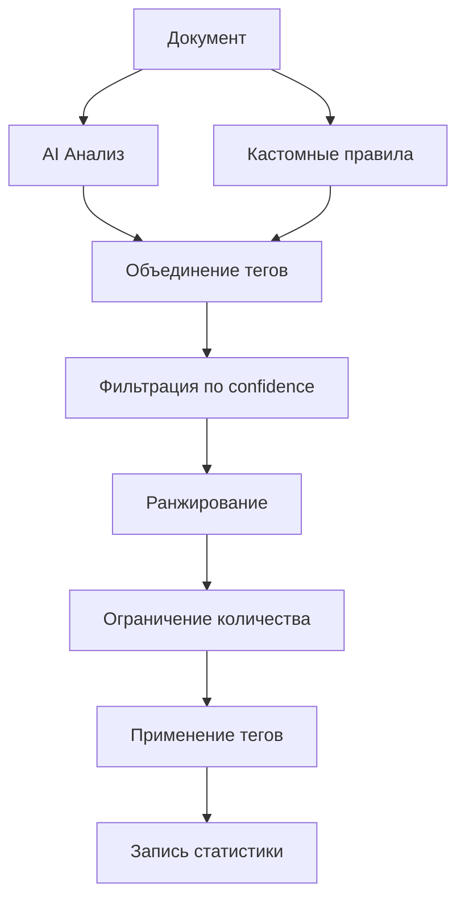

## 🎓 Расширенная интеграция с Paperless-AI

## Обзор

Продвинутая интеграция с Paperless-AI предоставляет мощные инструменты для автоматического тегирования документов с использованием искусственного интеллекта, кастомных правил и систем обучения.

## Новые возможности

### ✨ Основные функции

1. **Умное тегирование (Smart Tagging)**
   - Комбинация AI и кастомных правил
   - Автоматическая фильтрация по уверенности
   - Ранжирование тегов по релевантности

2. **Кастомные правила тегирования**
   - Regex паттерны для точного поиска
   - Ключевые слова для быстрого определения
   - Настраиваемая уверенность для каждого правила
   - Множественные теги на одно правило

3. **Статистика и аналитика**
   - Отслеживание эффективности тегов
   - Процент принятия/отклонения
   - Топ-10 самых эффективных тегов
   - Метрики производительности AI моделей

4. **Система обучения**
   - Сбор данных о предложениях и применениях
   - Экспорт данных для обучения кастомных моделей
   - История обучения для анализа
   - Обратная связь для улучшения качества

## Установка и настройка

### Базовая конфигурация

```python
config = {
    "server_url": "http://192.168.1.125:8000",
    "api_token": "ваш_токен",
    
    # Основные настройки
    "auto_categorize": True,
    "auto_tag": True,
    "confidence_threshold": 0.7,
    
    # Расширенные настройки
    "enable_learning": True,
    "enable_custom_rules": True,
    "statistics_enabled": True,
    "min_tag_confidence": 0.5,
    "max_tags_per_document": 10
}
```

### Доступ к расширенным функциям

1. Откройте **Настройки → 📄 Интеграция с Paperless-NGX**
2. Перейдите во вкладку **AI Тегирование**
3. Нажмите **🎓 Управление AI (правила, статистика, обучение)**

## Кастомные правила тегирования

### Создание правила

1. **Откройте вкладку "📋 Кастомные правила"**
2. **Заполните форму:**
   - **Название**: Описательное имя правила
   - **Паттерн**: Regex или ключевые слова
   - **Теги**: Список тегов через запятую
   - **Уверенность**: 0.1-1.0 (рекомендуется 0.8-1.0)
   - **Активно**: Включено/Выключено

3. **Нажмите "Сохранить правило"**

### Примеры правил

#### Пример 1: Определение счетов-фактур
```
Название: Счет-фактура
Паттерн: счет[-\s]?фактур[аы]
Теги: Счет-фактура, Первичный документ
Уверенность: 0.95
```

#### Пример 2: Документы с НДС
```
Название: НДС 20%
Паттерн: ндс.*20\s*%
Теги: НДС 20%, С налогом
Уверенность: 0.9
```

#### Пример 3: Определение по дате
```
Название: Документы 2025
Паттерн: \d{2}\.(0[1-9]|1[0-2])\.2025
Теги: 2025 год, Текущий период
Уверенность: 1.0
```

#### Пример 4: Поставщик
```
Название: ООО Поставщик
Паттерн: ^ООО.*Поставщик
Теги: Основной поставщик, Проверенный
Уверенность: 0.85
```

### Синтаксис паттернов

#### Regex операторы:
- `.` - любой символ
- `*` - ноль или более повторений
- `+` - один или более повторений
- `?` - ноль или одно повторение
- `\d` - цифра
- `\w` - буква/цифра
- `\s` - пробел
- `^` - начало строки
- `$` - конец строки
- `[abc]` - один из символов a, b или c
- `(a|b)` - a или b

#### Примеры:
```regex
\d{10}           # ИНН (10 цифр)
\d{2}\.\d{2}\.\d{4}  # Дата DD.MM.YYYY
[А-Я]{2,}        # Заглавные русские буквы (2+)
\d+\.\d{2}       # Сумма с копейками
```

## Статистика и аналитика

### Метрики производительности

#### Общая статистика:
- **Всего документов**: Количество обработанных документов
- **Предложено тегов**: Общее количество предложенных AI тегов
- **Применено тегов**: Количество примененных тегов
- **Процент принятия**: Соотношение применено/предложено
- **Время сессии**: Длительность активной сессии

#### Детальная статистика по тегам:
- **Точность тега**: Процент применения тега от предложений
- **Применено/Отклонено**: Количество успешных и отклоненных применений
- **Средняя уверенность**: Средний confidence score тега

### Топ-10 тегов

Список самых эффективных тегов, отсортированных по:
- Точности применения
- Количеству использований
- Взвешенной оценке (точность × использование)

### Экспорт статистики

1. Откройте вкладку **📊 Статистика**
2. Нажмите **📊 Экспорт статистики**
3. Выберите место сохранения
4. Файл будет сохранен в формате JSON

**Формат экспорта:**
```json
{
  "total_documents": 150,
  "total_tags_suggested": 450,
  "total_tags_applied": 320,
  "acceptance_rate": 0.711,
  "tag_accuracy": {
    "Счет-фактура": {
      "accuracy": 0.95,
      "applied": 38,
      "rejected": 2,
      "avg_confidence": 0.92
    }
  },
  "top_tags": [
    ["Счет-фактура", 36.1],
    ["НДС 20%", 28.5]
  ]
}
```

## Система обучения

### Сбор данных

Система автоматически собирает:
- Предложенные теги для каждого документа
- Примененные теги пользователем
- Confidence scores
- Источник тегов (AI, кастомные правила)
- Временные метки

### Настройки обучения

1. **Включить сбор данных**: Активирует историю обучения
2. **Размер истории**: Максимальное количество записей (100-10000)

### Экспорт обучающих данных

1. Откройте вкладку **🎓 Обучение**
2. Нажмите **📤 Экспорт данных для обучения**
3. Выберите место сохранения

**Формат данных:**
```json
{
  "suggestion_history": [
    {
      "document_id": 123,
      "timestamp": "2025-10-02T20:00:00",
      "suggested_tags": [
        {
          "name": "Счет",
          "confidence": 0.9,
          "source": "ai"
        }
      ],
      "applied_tags": ["Счет"]
    }
  ],
  "statistics": {...},
  "custom_rules": {...}
}
```

### Использование данных для обучения

Экспортированные данные можно использовать для:
1. **Fine-tuning моделей ML**
2. **Анализа качества тегирования**
3. **Оптимизации правил**
4. **Создания датасетов**

## Умное тегирование (Smart Tagging)

### Алгоритм работы



### Процесс умного тегирования:

1. **AI анализ**: Paperless-AI предлагает теги
2. **Кастомные правила**: Применяются пользовательские правила
3. **Объединение**: Теги собираются в общий список
4. **Фильтрация**: Удаляются теги с низкой уверенностью
5. **Ранжирование**: Сортировка по confidence
6. **Ограничение**: Максимум N тегов (по умолчанию 10)
7. **Применение**: Автоматическое или ручное применение
8. **Статистика**: Запись результатов

### Пример использования через API:

```python
from app.plugins.integrations.paperless_ai_advanced import PaperlessAIAdvanced

# Инициализация
ai_plugin = PaperlessAIAdvanced(config)
ai_plugin.initialize()
ai_plugin.connect()

# Умное тегирование
result = ai_plugin.smart_tag_document(
    document_id=123,
    content="Счет-фактура №456 от 01.10.2025..."
)

print(result)
# {
#   "status": "success",
#   "suggested_tags": [
#     {"name": "Счет-фактура", "confidence": 0.95, "source": "custom_rule"},
#     {"name": "2025 год", "confidence": 1.0, "source": "custom_rule"},
#     {"name": "Первичный документ", "confidence": 0.88, "source": "ai"}
#   ],
#   "applied_tags": ["Счет-фактура", "2025 год", "Первичный документ"]
# }
```

## Workflow интеграции

### Сценарий 1: Автоматическое тегирование после обработки

1. InvoiceGemini обрабатывает документ
2. Документ экспортируется в Paperless-NGX
3. Автоматически запускается умное тегирование:
   - AI анализирует содержимое
   - Применяются кастомные правила
   - Теги автоматически добавляются
4. Статистика обновляется
5. Данные сохраняются для обучения

### Сценарий 2: Обучение на исторических данных

1. Накопление данных за период (месяц/квартал)
2. Экспорт обучающих данных
3. Анализ эффективности тегов
4. Корректировка кастомных правил
5. Создание новых правил на основе статистики
6. Fine-tuning AI модели (опционально)

### Сценарий 3: Оптимизация правил

1. Просмотр статистики тегов
2. Выявление неэффективных правил (низкая точность)
3. Анализ причин отклонения тегов
4. Корректировка паттернов правил
5. Тестирование на исторических данных
6. Активация улучшенных правил

## Лучшие практики

### Создание правил:
1. **Начинайте с простых паттернов** - проще отладить
2. **Тестируйте на примерах** - проверяйте regex перед сохранением
3. **Используйте высокую уверенность** (0.8+) для критичных тегов
4. **Группируйте связанные теги** в одном правиле
5. **Регулярно проверяйте статистику** - выявляйте неработающие правила

### Оптимизация AI:
1. **Собирайте данные минимум месяц** перед обучением
2. **Экспортируйте статистику регулярно** для анализа
3. **Корректируйте порог уверенности** на основе статистики
4. **Ограничивайте количество тегов** (5-10 оптимально)
5. **Используйте feedback** - отмечайте неправильные теги

### Мониторинг:
1. **Еженедельно проверяйте топ тегов** - выявляйте аномалии
2. **Отслеживайте процент принятия** - должен быть >70%
3. **Анализируйте отклоненные теги** - улучшайте правила
4. **Сравнивайте AI vs правила** - находите оптимальный баланс

## Устранение проблем

### Низкая точность тегирования

**Проблема**: Теги часто неправильные или нерелевантные

**Решения**:
1. Повысьте `confidence_threshold` до 0.8
2. Уменьшите `max_tags_per_document` до 5
3. Создайте более специфичные кастомные правила
4. Проверьте качество OCR текста

### Правила не срабатывают

**Проблема**: Кастомные правила не находят совпадения

**Решения**:
1. Проверьте синтаксис regex на [regex101.com](https://regex101.com)
2. Учитывайте регистр (используйте `(?i)` для игнорирования)
3. Проверьте, что правило включено (Активно = ✓)
4. Тестируйте на реальных примерах текста

### Переизбыток тегов

**Проблема**: Слишком много тегов на документ

**Решения**:
1. Уменьшите `max_tags_per_document`
2. Повысьте `min_tag_confidence`
3. Объедините похожие правила
4. Отключите неэффективные правила

## Интеграция с InvoiceGemini

### Автоматическое применение после обработки

```python
# В main_window.py после обработки документа
def process_complete(self, result):
    # ... обработка результатов ...
    
    # Экспорт в Paperless с AI тегированием
    if paperless_enabled:
        paperless_plugin.sync_data(result, direction="export")
        
        # Запуск умного тегирования
        if ai_enabled:
            ai_plugin.smart_tag_document(
                document_id=paperless_doc_id,
                content=result.get("extracted_text")
            )
```

### Синхронизация тегов обратно

```python
# Получаем AI теги из Paperless
ai_tags = ai_plugin.sync_tags_from_paperless(
    document_id=123,
    invoice_data=current_data
)

# Добавляем в InvoiceGemini
if ai_tags["status"] == "success":
    invoice_data["ai_tags"] = ai_tags["tags"]
    update_invoice_display(invoice_data)
```

## Roadmap

### Планируемые улучшения:
- [ ] Поддержка множественных AI моделей одновременно
- [ ] Визуальный редактор правил с live preview
- [ ] A/B тестирование правил
- [ ] Автоматическое создание правил на основе статистики
- [ ] Интеграция с внешними ML сервисами
- [ ] Collaborative filtering для тегов
- [ ] Экспорт в форматы для популярных ML фреймворков

---

**Версия**: 2.0.0  
**Дата**: 02.10.2025  
**Совместимость**: InvoiceGemini 1.0+, Paperless-NGX 1.10+, Paperless-AI 2.0+

