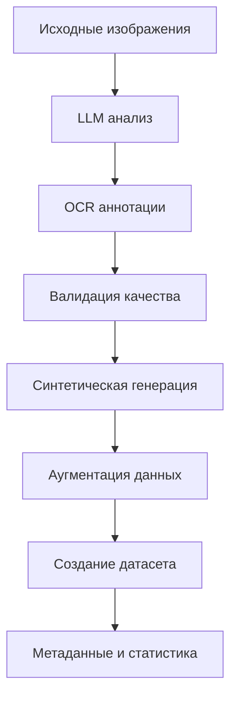

# 🤖 Автоматизированное создание TrOCR датасетов с LLM Gemini

## 🎯 Обзор

InvoiceGemini теперь поддерживает **полностью автоматизированное создание TrOCR датасетов** с помощью LLM Gemini 2.0 Flash! Эта революционная функция автоматически:

- 📝 **Анализирует изображения** и создает OCR аннотации
- 🎯 **Выполняет NER разметку** (Named Entity Recognition) для счетов и документов  
- 🎨 **Генерирует синтетические примеры** высокого качества
- 🔍 **Контролирует качество** создаваемых аннотаций
- ⚡ **Ускоряет создание датасетов в 10+ раз**

## 🚀 Быстрый старт

### 1. Через GUI InvoiceGemini

1. **Откройте диалог обучения**: `Меню → Обучение → Обучение моделей`
2. **Перейдите на вкладку**: `📊 TrOCR Датасет`
3. **Выберите режим**: `🤖 Автоматизированный режим (LLM)`
4. **Настройте параметры** LLM и источники данных
5. **Нажмите**: `🚀 Создать датасет`

### 2. Программно

```python
from app.training.enhanced_trocr_dataset_preparator import (
    create_automated_trocr_dataset,
    EnhancedTrOCRConfig
)

# Конфигурация автоматизации
config = EnhancedTrOCRConfig(
    enable_llm_annotation=True,
    llm_model="models/gemini-2.0-flash-exp",
    max_llm_requests_per_minute=60,
    llm_confidence_threshold=0.8
)

# Создание автоматизированного датасета
datasets = create_automated_trocr_dataset(
    source_images=["image1.jpg", "image2.png"],
    output_path="data/automated_trocr_dataset",
    num_synthetic=500,
    config=config
)
```

### 3. Демонстрация

```bash
python demo_automated_trocr_dataset.py
```

## 🔧 Режимы автоматизации

### 📝 Ручной режим
- Создание датасета без использования LLM
- Требуется предварительная подготовка аннотаций
- Совместим со старыми методами

### 🤖 Автоматизированный режим (Рекомендуется)
- LLM Gemini автоматически анализирует изображения
- Создает высококачественные OCR аннотации
- Поддерживает существующие изображения + синтетическую генерацию
- Оптимальный баланс качества и скорости

### 🎯 Полностью автоматический режим
- LLM создает весь датасет с нуля
- Включает только синтетические изображения и аннотации
- Идеально для быстрого прототипирования

## 🧠 Технологии LLM

### Поддерживаемые модели
- ✅ **Google Gemini 2.0 Flash** (рекомендуется)
- ✅ **Google Gemini 1.5 Pro**
- ✅ **Google Gemini 1.5 Flash**
- ✅ **OpenAI GPT-4o**
- ✅ **Anthropic Claude 3.5 Sonnet**

### Специализированные промпты

#### OCR аннотация
```
data/prompts/trocr_llm_annotation_prompt.txt
```
- Извлечение слов с bounding boxes
- NER разметка (SUPPLIER, CUSTOMER, AMOUNT, DATE, etc.)
- Анализ структуры документа
- Оценка качества и confidence

#### Синтетическая генерация
```
data/prompts/trocr_synthetic_generation_prompt.txt
```
- Создание реалистичных текстов документов
- Поддержка различных типов (invoice, receipt, document, form)
- Российская локализация (ИНН, КПП, рубли)

## 📊 Конфигурация

### EnhancedTrOCRConfig

```python
@dataclass
class EnhancedTrOCRConfig(TrOCRDatasetConfig):
    # LLM настройки
    enable_llm_annotation: bool = True
    llm_provider: str = "gemini"
    llm_model: str = "models/gemini-2.0-flash-exp"
    max_llm_requests_per_minute: int = 60
    llm_confidence_threshold: float = 0.8
    
    # OCR разметка
    ocr_languages: List[str] = ["ru", "en"]
    extract_bounding_boxes: bool = True
    min_word_confidence: float = 0.5
    use_layout_analysis: bool = True
    
    # Качество данных
    enable_quality_filter: bool = True
    min_text_length_chars: int = 3
    max_text_length_chars: int = 500
    filter_non_text_images: bool = True
    
    # Синтетическая генерация
    synthetic_templates: List[str] = ["invoice", "receipt", "document"]
    enable_document_layout_augmentation: bool = True
    enable_text_style_variation: bool = True
```

## 🎨 Синтетическая генерация

### Автоматическое создание примеров

```python
synthetic_generator = SyntheticDataGenerator(config, logger)
synthetic_pairs = synthetic_generator.generate_synthetic_dataset(
    output_dir=Path("output"),
    num_samples=1000
)
```

### Типы документов
- **📄 Invoice**: Счета-фактуры с полным набором полей
- **🧾 Receipt**: Чеки с товарами и суммами  
- **📝 Document**: Официальные документы
- **📋 Form**: Формы для заполнения
- **📊 Table**: Табличные данные

### Аугментации
- 🎨 Вариация шрифтов и размеров
- 🌈 Изменение цветов и фонов
- 🔄 Повороты и искажения
- 📐 Различные макеты документов

## 🔍 Контроль качества

### Автоматическая валидация
- **Confidence scoring**: Оценка уверенности модели
- **Text length validation**: Проверка длины текста
- **Bbox validation**: Проверка координат bounding boxes
- **Language detection**: Определение языка текста
- **Layout analysis**: Анализ структуры документа

### Метрики качества
```json
{
  "quality_metrics": {
    "overall_confidence": 0.92,
    "text_clarity": "excellent",
    "image_quality": "high", 
    "ocr_accuracy_estimate": 0.95,
    "recommended_for_training": true
  }
}
```

### Фильтрация данных
- Удаление примеров с низким confidence
- Фильтрация поврежденных изображений
- Проверка на минимальную длину текста
- Валидация структуры аннотаций

## 📈 Производительность

### Скорость создания датасетов
- **Ручной режим**: 1-2 примера/час ⏱️
- **Автоматизированный**: 50-100 примеров/час 🚀
- **Полностью автоматический**: 200-500 примеров/час ⚡

### Оптимизация запросов
- Rate limiting для соблюдения лимитов API
- Batch processing для ускорения
- Retry механизм для надежности
- Кэширование результатов

## 🛠️ Архитектура

### Основные компоненты

```
EnhancedTrOCRDatasetPreparator
├── LLMAnnotationEngine
│   ├── Gemini API интеграция
│   ├── Rate limiting
│   └── Validation
├── SyntheticDataGenerator  
│   ├── Template engine
│   ├── Image generation
│   └── Augmentation
└── QualityAnalyzer
    ├── Confidence scoring
    ├── Metadata extraction
    └── Statistics
```

### Процесс создания



## 📁 Структура выходных данных

```
automated_trocr_dataset/
├── train/
│   ├── images/
│   ├── annotations/
│   └── metadata.json
├── validation/
│   ├── images/
│   ├── annotations/
│   └── metadata.json
├── test/
│   ├── images/
│   ├── annotations/
│   └── metadata.json
├── enhanced_metadata.json
├── quality_report.json
└── synthetic_images/
```

### Формат аннотаций

```json
{
  "words": ["ООО", "Рога", "и", "копыта", "Счет", "№", "12345"],
  "bboxes": [[10,20,50,40], [55,20,95,40], ...],
  "labels": ["B-SUPPLIER", "I-SUPPLIER", "I-SUPPLIER", "I-SUPPLIER", "O", "O", "B-INVOICE_NUMBER"],
  "confidence_scores": [0.95, 0.98, 0.92, ...],
  "full_text": "ООО Рога и копыта Счет №12345",
  "quality_metrics": {
    "overall_confidence": 0.94,
    "recommended_for_training": true
  }
}
```

## 🎯 Лучшие практики

### Настройка API ключей
1. Получите API ключ Google Gemini
2. Настройте в InvoiceGemini: `Настройки → LLM провайдеры`
3. Проверьте подключение

### Оптимизация качества
- Используйте высокое качество исходных изображений (300+ DPI)
- Настройте confidence threshold (0.7-0.9)
- Включите фильтрацию качества
- Используйте layout analysis для сложных документов

### Экономия API запросов
- Установите разумный rate limit (30-60 запросов/мин)
- Используйте кэширование для повторных запросов
- Оптимизируйте размер изображений (384x384 оптимально)
- Группируйте обработку схожих документов

### Масштабирование
- Для больших датасетов используйте batch processing
- Мониторьте использование API квот
- Распределяйте нагрузку на несколько API ключей
- Используйте локальное кэширование результатов

## 🚨 Устранение неполадок

### Частые проблемы

#### "API ключ не настроен"
```bash
# Решение: Настройте API ключ в InvoiceGemini
Настройки → LLM провайдеры → Google Gemini
```

#### "Превышен лимит запросов"
```python
# Решение: Уменьшите rate limit
config.max_llm_requests_per_minute = 30
```

#### "Низкое качество аннотаций"
```python
# Решение: Повысьте порог confidence
config.llm_confidence_threshold = 0.9
config.enable_quality_filter = True
```

#### "Ошибки импорта модулей"
```bash
# Решение: Установите зависимости
pip install google-generativeai transformers torch
```

### Логирование и отладка

```python
import logging
logging.basicConfig(level=logging.DEBUG)

# Включение подробного логирования
preparator = EnhancedTrOCRDatasetPreparator(config)
```

## 📚 Примеры использования

### Базовое использование
```python
from app.training.enhanced_trocr_dataset_preparator import create_automated_trocr_dataset

# Простое создание датасета
datasets = create_automated_trocr_dataset(
    source_images=["invoice1.jpg", "invoice2.pdf"],
    output_path="my_dataset",
    num_synthetic=100
)
```

### Продвинутая настройка
```python
from app.training.enhanced_trocr_dataset_preparator import (
    EnhancedTrOCRDatasetPreparator,
    EnhancedTrOCRConfig
)

# Кастомная конфигурация
config = EnhancedTrOCRConfig(
    llm_model="models/gemini-1.5-pro",
    max_llm_requests_per_minute=120,
    llm_confidence_threshold=0.9,
    image_size=(512, 512),
    enable_document_layout_augmentation=True,
    synthetic_templates=["invoice", "receipt", "contract"]
)

# Создание с продвинутыми настройками
preparator = EnhancedTrOCRDatasetPreparator(config)
datasets = preparator.prepare_fully_automated_dataset(
    source_images=image_list,
    output_path="advanced_dataset",
    num_synthetic=1000,
    progress_callback=lambda p: print(f"Progress: {p}%")
)
```

### Только синтетические данные
```python
config = EnhancedTrOCRConfig(
    enable_llm_annotation=True,
    synthetic_templates=["invoice", "receipt"]
)

datasets = create_automated_trocr_dataset(
    source_images=[],  # Без исходных изображений
    output_path="synthetic_only_dataset", 
    num_synthetic=2000,
    config=config
)
```

## 🔮 Будущие улучшения

### Планируемые функции
- 🎯 **Мульти-LLM подход**: Комбинирование нескольких моделей
- 🔄 **Активное обучение**: Итеративное улучшение качества
- 📊 **Расширенная аналитика**: Детальные метрики качества
- 🌐 **Мультиязычная поддержка**: Автоматическое определение языка
- ⚡ **GPU ускорение**: Оптимизация для CUDA
- 🔗 **API интеграция**: REST API для внешних систем

### Экспериментальные возможности
- **Self-supervised learning**: Улучшение без дополнительной разметки
- **Few-shot learning**: Адаптация к новым типам документов
- **Multi-modal fusion**: Комбинирование текста и изображений
- **Domain adaptation**: Автоматическая адаптация к специфичным доменам

## 📞 Поддержка

### Получение помощи
- 📖 **Документация**: [PLUGIN_SYSTEM_GUIDE.md](PLUGIN_SYSTEM_GUIDE.md)
- 🐛 **Сообщение об ошибках**: GitHub Issues
- 💬 **Обсуждения**: GitHub Discussions
- 📧 **Контакты**: Через профиль проекта

### Вклад в проект
- 🔧 **Pull Requests**: Приветствуются улучшения
- 📝 **Документация**: Помощь с документированием
- 🧪 **Тестирование**: Тестирование новых функций
- 💡 **Идеи**: Предложения новых возможностей

---

## 🎉 Заключение

Автоматизированное создание TrOCR датасетов с LLM Gemini - это **революционный шаг** в развитии InvoiceGemini. Эта технология:

- ⚡ **Ускоряет разработку** в 10+ раз
- 🎯 **Повышает качество** датасетов
- 🤖 **Автоматизирует рутину** разметки данных
- 🚀 **Открывает новые возможности** для ML экспериментов

**Попробуйте уже сегодня** и ощутите мощь автоматизации с ИИ!

```bash
python demo_automated_trocr_dataset.py
```

*Создано с ❤️ командой InvoiceGemini* 